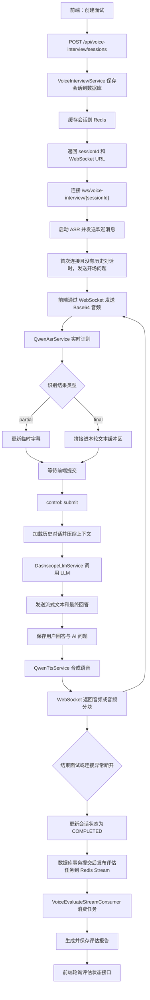

---
summary:
tags:
created: 2026-11-23
updated: 2026-11-23
---
相关网址：

相关笔记：

---

```mermaid
flowchart TD
    A["前端：创建面试"] --> B["POST /api/voice-interview/sessions"]
    B --> C["VoiceInterviewService 保存会话到数据库"]
    C --> D["缓存会话到 Redis"]
    D --> E["返回 sessionId 和 WebSocket URL"]

    E --> F["连接 /ws/voice-interview/{sessionId}"]
    F --> G["启动 ASR 并发送欢迎消息"]
    G --> H["首次连接且没有历史对话时，发送开场问题"]

    H --> I["前端通过 WebSocket 发送 Base64 音频"]
    I --> J["QwenAsrService 实时识别"]
    J --> K{"识别结果类型"}
    K -->|"partial"| L["更新临时字幕"]
    K -->|"final"| M["拼接进本轮文本缓冲区"]
    L --> N["等待前端提交"]
    M --> N

    N --> O["control: submit"]
    O --> P["加载历史对话并压缩上下文"]
    P --> Q["DashscopeLlmService 调用 LLM"]
    Q --> R["发送流式文本和最终回答"]
    R --> S["保存用户回答与 AI 问题"]
    S --> T["QwenTtsService 合成语音"]
    T --> U["WebSocket 返回音频或音频分块"]
    U --> I

    U --> V{"结束面试或连接异常断开"}
    V --> W["更新会话状态为 COMPLETED"]
    W --> X["数据库事务提交后发布评估任务到 Redis Stream"]
    X --> Y["VoiceEvaluateStreamConsumer 消费任务"]
    Y --> Z["生成并保存评估报告"]
    Z --> AA["前端轮询评估状态接口"]
```
